# Azure End-to-End Data Engineering Project

## 🎯 Project Overview

This project demonstrates a **complete end-to-end data engineering solution** on Microsoft Azure, implementing a modern data lakehouse architecture using the **Medallion Architecture** (Bronze, Silver, Gold layers). The pipeline processes AdventureWorks dataset through various Azure services to deliver analytics-ready data for business intelligence.

### Key Highlights

- ✅ **Automated Data Ingestion**: Azure Data Factory pipelines with HTTP connectors
- ✅ **Scalable Storage**: Azure Data Lake Storage Gen2 (ADLS Gen2)
- ✅ **Big Data Processing**: Azure Databricks with Apache Spark
- ✅ **Data Warehousing**: Azure Synapse Analytics
- ✅ **Business Intelligence**: Power BI dashboards
- ✅ **Medallion Architecture**: Bronze → Silver → Gold data layers

---

## 🏗️ Architecture

```mermaid
flowchart TB
    subgraph Source["📦 Data Source"]
        GH[("GitHub Repository<br/>AdventureWorks Data<br/>(CSV Files)")]
    end

    subgraph Ingestion["🔄 Data Ingestion Layer"]
        ADF["Azure Data Factory<br/>HTTP Connector<br/>Copy Activities"]
    end

    subgraph Storage["💾 Data Lake Storage Gen2"]
        Bronze[("🥉 Bronze Layer<br/>(Raw Data)<br/>ADLS Gen2")]
    end

    subgraph Transformation["⚙️ Data Transformation Layer"]
        DB["Azure Databricks<br/>Apache Spark<br/>PySpark Notebooks"]
        Silver[("🥈 Silver Layer<br/>(Cleaned Data)<br/>ADLS Gen2")]
    end

    subgraph Serving["🎯 Data Serving Layer"]
        Synapse["Azure Synapse Analytics<br/>SQL Pool<br/>Data Warehouse"]
        Gold[("🥇 Gold Layer<br/>(Curated Data)<br/>ADLS Gen2")]
    end

    subgraph BI["📊 Business Intelligence"]
        PBI["Power BI<br/>Dashboards & Reports"]
    end

    %% Data Flow
    GH -->|HTTP GET| ADF
    ADF -->|Ingest Raw Data| Bronze
    Bronze -->|Read Raw Data| DB
    DB -->|Transform & Clean| Silver
    Silver -->|Load Transformed| Synapse
    Synapse -->|Aggregate & Model| Gold
    Gold -->|Query & Visualize| PBI
    Synapse -.->|Direct Query| PBI

    %% Styling
    classDef sourceStyle fill:#e1f5ff,stroke:#0078d4,stroke-width:2px
    classDef ingestionStyle fill:#fff4ce,stroke:#ff6c00,stroke-width:2px
    classDef storageStyle fill:#d4f1dd,stroke:#107c10,stroke-width:2px
    classDef transformStyle fill:#fce8e8,stroke:#e81123,stroke-width:2px
    classDef servingStyle fill:#e5e5f7,stroke:#5e5e5e,stroke-width:2px
    classDef biStyle fill:#fff3cd,stroke:#f2c811,stroke-width:2px

    class GH sourceStyle
    class ADF ingestionStyle
    class Bronze,Silver,Gold storageStyle
    class DB transformStyle
    class Synapse servingStyle
    class PBI biStyle
```

---

## 📊 Data Flow Explanation

### 1️⃣ **Data Source** (GitHub)
- AdventureWorks sample dataset stored as CSV files
- Includes: Calendar, Customers, Products, Sales, Returns, Territories
- Raw business data across multiple years (2015-2017)

### 2️⃣ **Data Ingestion** (Azure Data Factory)
- **HTTP Connector**: Fetches data from GitHub repository
- **Copy Activity**: Orchestrates data movement
- **Pipeline Triggers**: Scheduled or event-based execution
- **Incremental Loading**: Supports full and incremental loads

### 3️⃣ **Bronze Layer** (Raw Data - ADLS Gen2)
- **Purpose**: Store raw, unprocessed data exactly as ingested
- **Format**: CSV files (original format)
- **Schema**: No schema enforcement
- **Retention**: Long-term storage for audit and reprocessing

### 4️⃣ **Transformation Layer** (Azure Databricks + Spark)
- **Data Cleaning**: Handle nulls, duplicates, data quality issues
- **Data Transformation**: Type conversions, calculations, enrichment
- **PySpark Jobs**: Distributed processing for large datasets
- **Schema Evolution**: Handle schema changes gracefully

### 5️⃣ **Silver Layer** (Cleaned Data - ADLS Gen2)
- **Purpose**: Store validated and cleaned data
- **Format**: Parquet (columnar, compressed)
- **Schema**: Enforced schema with data types
- **Quality**: Data quality rules applied

### 6️⃣ **Serving Layer** (Azure Synapse Analytics)
- **SQL Pool**: MPP (Massively Parallel Processing) engine
- **Data Warehouse**: Dimensional modeling (Star/Snowflake schema)
- **Views & Stored Procedures**: Business logic encapsulation
- **Performance**: Optimized for analytical queries

### 7️⃣ **Gold Layer** (Curated Data - ADLS Gen2)
- **Purpose**: Business-ready aggregated datasets
- **Format**: Parquet or Delta Lake
- **Structure**: Denormalized, optimized for reporting
- **Use Case**: Direct consumption by BI tools

### 8️⃣ **Business Intelligence** (Power BI)
- **Dashboards**: Interactive visualizations
- **Reports**: Scheduled and on-demand reports
- **DirectQuery**: Real-time data from Synapse
- **Import Mode**: Pre-aggregated datasets from Gold layer

---

## 📊 Dataset Description

### AdventureWorks Dataset

The **AdventureWorks** dataset is a sample database provided by Microsoft, representing a fictitious bicycle manufacturer's business operations.

| File | Records | Description |
|------|---------|-------------|
| **Calendar** | 1,461 | Date dimension (2015-2018) |
| **Customers** | 18,484 | Customer master data |
| **Product_Categories** | 8 | Product category hierarchy |
| **Product_Subcategories** | 37 | Product subcategory details |
| **Products** | 293 | Product master data |
| **Returns** | 1,809 | Product returns |
| **Sales_2015** | 25,287 | Sales transactions (2015) |
| **Sales_2016** | 33,429 | Sales transactions (2016) |
| **Sales_2017** | 41,317 | Sales transactions (2017) |
| **Territories** | 10 | Sales territories |

**Total Records**: ~120,000+ transactions

---

## 🎯 Key Features

### 1. Medallion Architecture

- **Bronze Layer**: Raw data ingestion (CSV → ADLS Gen2)
- **Silver Layer**: Cleaned and validated data (Parquet format)
- **Gold Layer**: Business-ready aggregated data (optimized for BI)

### 2. Scalable Processing

- **Apache Spark**: Distributed processing for large datasets
- **Auto-scaling**: Databricks clusters scale based on workload
- **Partitioning**: Data partitioned by date for efficient queries

### 3. Data Quality

- **Validation Rules**: Null checks, duplicate detection
- **Schema Enforcement**: Strong typing in Silver layer
- **Audit Logging**: Track data lineage and transformations

### 4. Performance Optimization

- **Columnar Storage**: Parquet format for analytical queries
- **Compression**: Snappy compression for storage efficiency
- **Indexing**: Clustered columnstore index in Synapse
- **Caching**: Strategic caching in Databricks

---

## 📈 Use Cases & Analytics

### Sales Analytics
- Revenue trends over time
- Top-selling products and categories
- Customer purchase patterns
- Geographic sales distribution

### Customer Analytics
- Customer segmentation
- Lifetime value analysis
- Churn prediction
- Customer demographics

### Product Analytics
- Product performance metrics
- Return rate analysis
- Category profitability
- Inventory optimization

### Territory Analytics
- Regional sales comparison
- Territory growth trends
- Market penetration analysis

---

## 🔐 Security & Governance

### Authentication & Authorization
- **Azure Active Directory**: Centralized identity management
- **Service Principal**: Application authentication
- **Managed Identity**: Secure service-to-service authentication

### Data Security
- **Encryption at Rest**: Azure Storage encryption
- **Encryption in Transit**: TLS 1.2+
- **Network Security**: Private endpoints, VNet integration
- **RBAC**: Role-based access control

### Compliance
- **Data Lineage**: Track data from source to destination
- **Audit Logs**: Monitor all data access and transformations
- **Data Retention**: Configurable retention policies

---

## 📝 License

This project is licensed under the MIT License - see the [LICENSE](LICENSE) file for details.

---

## 👨‍💻 Author

**Moulaye Ahmed Mohammed Brahim**

- 🌐 Portfolio: [mulayemuhammad.github.io/Moulaye_DS_Portfolio](https://mulayemuhammad.github.io/Moulaye_DS_Portfolio/)
- 💼 LinkedIn: [Moulaye Ahmed MUHAMMAD](https://www.linkedin.com/in/moulaye-ahmed-muhammad/)
- 🐙 GitHub: [@MulayeMuhammad](https://github.com/MulayeMuhammad)
- 📧 Email: mulayemuhammad@gmail.com
- 🐦 Twitter: [@MuhammadMoulaye](https://twitter.com/MuhammadMoulaye)

---

## 🙏 Acknowledgments

- **Microsoft** for Azure platform and AdventureWorks dataset
- **Databricks** for Apache Spark runtime
- **Azure community** for best practices and guidance

---

## 🔗 Useful Links

- [Azure Data Factory Documentation](https://docs.microsoft.com/azure/data-factory/)
- [Azure Databricks Documentation](https://docs.microsoft.com/azure/databricks/)
- [Azure Synapse Analytics Documentation](https://docs.microsoft.com/azure/synapse-analytics/)
- [ADLS Gen2 Documentation](https://docs.microsoft.com/azure/storage/blobs/data-lake-storage-introduction)
- [Power BI Documentation](https://docs.microsoft.com/power-bi/)

---

## 📊 Project Status

- [x] Data ingestion pipeline (ADF)
- [x] Bronze layer implementation
- [x] Databricks transformations
- [x] Silver layer implementation
- [x] Synapse Analytics setup
- [x] Gold layer implementation
- [ ] Power BI dashboards (In progress)
- [ ] CI/CD pipeline
- [ ] Automated testing

---

  <strong>Building Modern Data Platforms on Azure ☁️</strong>

  Made with ❤️ by <a href="https://github.com/MulayeMuhammad">Moulaye Ahmed</a>

