# Azure End-to-End Data Engineering Project

[](https://azure.microsoft.com/)
[](https://databricks.com/)
[](https://spark.apache.org/)
[](https://powerbi.microsoft.com/)

## 🎯 Project Overview

This project demonstrates a **complete end-to-end data engineering solution** on Microsoft Azure, implementing a modern data lakehouse architecture using the **Medallion Architecture** (Bronze, Silver, Gold layers). The pipeline processes AdventureWorks dataset through various Azure services to deliver analytics-ready data for business intelligence.

### Key Highlights

- ✅ **Automated Data Ingestion**: Azure Data Factory pipelines with HTTP connectors
- ✅ **Scalable Storage**: Azure Data Lake Storage Gen2 (ADLS Gen2)
- ✅ **Big Data Processing**: Azure Databricks with Apache Spark
- ✅ **Data Warehousing**: Azure Synapse Analytics
- ✅ **Business Intelligence**: Power BI dashboards
- ✅ **Medallion Architecture**: Bronze → Silver → Gold data layers

---

## 🏗️ Architecture

```mermaid
flowchart TB
    subgraph Source["📦 Data Source"]
        GH[("GitHub Repository<br/>AdventureWorks Data<br/>(CSV Files)")]
    end

    subgraph Ingestion["🔄 Data Ingestion Layer"]
        ADF["Azure Data Factory<br/>HTTP Connector<br/>Copy Activities"]
    end

    subgraph Storage["💾 Data Lake Storage Gen2"]
        Bronze[("🥉 Bronze Layer<br/>(Raw Data)<br/>ADLS Gen2")]
    end

    subgraph Transformation["⚙️ Data Transformation Layer"]
        DB["Azure Databricks<br/>Apache Spark<br/>PySpark Notebooks"]
        Silver[("🥈 Silver Layer<br/>(Cleaned Data)<br/>ADLS Gen2")]
    end

    subgraph Serving["🎯 Data Serving Layer"]
        Synapse["Azure Synapse Analytics<br/>SQL Pool<br/>Data Warehouse"]
        Gold[("🥇 Gold Layer<br/>(Curated Data)<br/>ADLS Gen2")]
    end

    subgraph BI["📊 Business Intelligence"]
        PBI["Power BI<br/>Dashboards & Reports"]
    end

    %% Data Flow
    GH -->|HTTP GET| ADF
    ADF -->|Ingest Raw Data| Bronze
    Bronze -->|Read Raw Data| DB
    DB -->|Transform & Clean| Silver
    Silver -->|Load Transformed| Synapse
    Synapse -->|Aggregate & Model| Gold
    Gold -->|Query & Visualize| PBI
    Synapse -.->|Direct Query| PBI

    %% Styling
    classDef sourceStyle fill:#e1f5ff,stroke:#0078d4,stroke-width:2px
    classDef ingestionStyle fill:#fff4ce,stroke:#ff6c00,stroke-width:2px
    classDef storageStyle fill:#d4f1dd,stroke:#107c10,stroke-width:2px
    classDef transformStyle fill:#fce8e8,stroke:#e81123,stroke-width:2px
    classDef servingStyle fill:#e5e5f7,stroke:#5e5e5e,stroke-width:2px
    classDef biStyle fill:#fff3cd,stroke:#f2c811,stroke-width:2px

    class GH sourceStyle
    class ADF ingestionStyle
    class Bronze,Silver,Gold storageStyle
    class DB transformStyle
    class Synapse servingStyle
    class PBI biStyle
```



---

## 📊 Data Flow Explanation

### 1️⃣ **Data Source** (GitHub)
- AdventureWorks sample dataset stored as CSV files
- Includes: Calendar, Customers, Products, Sales, Returns, Territories
- Raw business data across multiple years (2015-2017)

### 2️⃣ **Data Ingestion** (Azure Data Factory)
- **HTTP Connector**: Fetches data from GitHub repository
- **Copy Activity**: Orchestrates data movement
- **Pipeline Triggers**: Scheduled or event-based execution
- **Incremental Loading**: Supports full and incremental loads

### 3️⃣ **Bronze Layer** (Raw Data - ADLS Gen2)
- **Purpose**: Store raw, unprocessed data exactly as ingested
- **Format**: CSV files (original format)
- **Schema**: No schema enforcement
- **Retention**: Long-term storage for audit and reprocessing

### 4️⃣ **Transformation Layer** (Azure Databricks + Spark)
- **Data Cleaning**: Handle nulls, duplicates, data quality issues
- **Data Transformation**: Type conversions, calculations, enrichment
- **PySpark Jobs**: Distributed processing for large datasets
- **Schema Evolution**: Handle schema changes gracefully

### 5️⃣ **Silver Layer** (Cleaned Data - ADLS Gen2)
- **Purpose**: Store validated and cleaned data
- **Format**: Parquet (columnar, compressed)
- **Schema**: Enforced schema with data types
- **Quality**: Data quality rules applied

### 6️⃣ **Serving Layer** (Azure Synapse Analytics)
- **SQL Pool**: MPP (Massively Parallel Processing) engine
- **Data Warehouse**: Dimensional modeling (Star/Snowflake schema)
- **Views & Stored Procedures**: Business logic encapsulation
- **Performance**: Optimized for analytical queries

### 7️⃣ **Gold Layer** (Curated Data - ADLS Gen2)
- **Purpose**: Business-ready aggregated datasets
- **Format**: Parquet or Delta Lake
- **Structure**: Denormalized, optimized for reporting
- **Use Case**: Direct consumption by BI tools

### 8️⃣ **Business Intelligence** (Power BI)
- **Dashboards**: Interactive visualizations
- **Reports**: Scheduled and on-demand reports
- **DirectQuery**: Real-time data from Synapse
- **Import Mode**: Pre-aggregated datasets from Gold layer

---

## 📁 Project Structure

```
Azure-End-To-End-Data-Engineering/
│
├── Data/                                    # Source CSV files
│   ├── AdventureWorks_Calendar.csv
│   ├── AdventureWorks_Customers.csv
│   ├── AdventureWorks_Product_Categories.csv
│   ├── AdventureWorks_Product_Subcategories.csv
│   ├── AdventureWorks_Products.csv
│   ├── AdventureWorks_Returns.csv
│   ├── AdventureWorks_Sales_2015.csv
│   ├── AdventureWorks_Sales_2016.csv
│   ├── AdventureWorks_Sales_2017.csv
│   └── AdventureWorks_Territories.csv
│
├── ADF/                                     # Azure Data Factory
│   ├── pipelines/
│   │   ├── pl_ingest_adventureworks.json
│   │   └── pl_incremental_load.json
│   ├── datasets/
│   │   ├── ds_github_http.json
│   │   └── ds_adls_bronze.json
│   └── linked_services/
│       ├── ls_http_github.json
│       └── ls_adls_gen2.json
│
├── Databricks/                              # Databricks Notebooks
│   ├── bronze_to_silver/
│   │   ├── 01_clean_customers.py
│   │   ├── 02_clean_products.py
│   │   ├── 03_clean_sales.py
│   │   └── 04_clean_returns.py
│   ├── silver_to_gold/
│   │   ├── 01_aggregate_sales.py
│   │   ├── 02_customer_analytics.py
│   │   └── 03_product_performance.py
│   └── utils/
│       ├── data_quality_checks.py
│       └── common_transformations.py
│
├── Synapse/                                 # Azure Synapse Analytics
│   ├── sql_scripts/
│   │   ├── create_tables.sql
│   │   ├── create_views.sql
│   │   └── load_procedures.sql
│   └── pipelines/
│       └── pl_load_warehouse.json
│
├── PowerBI/                                 # Power BI Reports
│   ├── AdventureWorks_Dashboard.pbix
│   └── Sales_Analytics.pbix
│
├── docs/
│   ├── architecture.md
│   ├── setup_guide.md
│   └── troubleshooting.md
│
├── scripts/
│   ├── setup_azure_resources.sh
│   └── deploy_pipelines.py
│
├── README.md                                # This file
├── requirements.txt
└── .gitignore
```

---

## 🚀 Getting Started

### Prerequisites

- **Azure Subscription** (with appropriate permissions)
- **Azure Services**:
  - Azure Data Factory
  - Azure Data Lake Storage Gen2
  - Azure Databricks
  - Azure Synapse Analytics
  - Power BI (Desktop or Service)
- **Tools**:
  - Azure CLI
  - Python 3.8+
  - Git

### Azure Resources Required

```bash
# Resource Group
Resource Group: rg-adventureworks-de

# Storage Account
Storage Account: stadventworksde
Container: bronze, silver, gold

# Data Factory
Data Factory: adf-adventureworks-de

# Databricks Workspace
Databricks: dbw-adventureworks-de
Cluster: spark-cluster-v1

# Synapse Analytics
Synapse Workspace: synapse-adventureworks-de
SQL Pool: sqldw-adventureworks
```

---

## 🛠️ Setup Instructions

### Step 1: Clone the Repository

```bash
git clone https://github.com/MulayeMuhammad/Azure-End-To-End-Data-Engineering.git
cd Azure-End-To-End-Data-Engineering
```

### Step 2: Create Azure Resources

```bash
# Login to Azure
az login

# Set subscription
az account set --subscription "Your-Subscription-ID"

# Create Resource Group
az group create --name rg-adventureworks-de --location eastus

# Create Storage Account
az storage account create \
  --name stadventworksde \
  --resource-group rg-adventureworks-de \
  --location eastus \
  --sku Standard_LRS \
  --kind StorageV2 \
  --hierarchical-namespace true

# Create containers
az storage container create --name bronze --account-name stadventworksde
az storage container create --name silver --account-name stadventworksde
az storage container create --name gold --account-name stadventworksde

# Create Data Factory
az datafactory create \
  --resource-group rg-adventureworks-de \
  --name adf-adventureworks-de \
  --location eastus
```

### Step 3: Configure Data Factory

1. Open Azure Data Factory Studio
2. Create Linked Services:
   - HTTP (for GitHub source)
   - ADLS Gen2 (for Bronze/Silver/Gold layers)
3. Create Datasets:
   - Source: HTTP dataset pointing to GitHub
   - Sink: ADLS Gen2 datasets
4. Create Pipeline:
   - Copy Activity from GitHub to Bronze layer
   - Set up triggers (schedule or event-based)

### Step 4: Setup Databricks

```bash
# Create Databricks Workspace
az databricks workspace create \
  --resource-group rg-adventureworks-de \
  --name dbw-adventureworks-de \
  --location eastus \
  --sku premium
```

**In Databricks:**
1. Create Cluster (Runtime 11.3 LTS or higher)
2. Mount ADLS Gen2 to Databricks
3. Import notebooks from `/Databricks/` folder
4. Configure cluster with required libraries

### Step 5: Setup Azure Synapse Analytics

```bash
# Create Synapse Workspace
az synapse workspace create \
  --name synapse-adventureworks-de \
  --resource-group rg-adventureworks-de \
  --storage-account stadventworksde \
  --file-system gold \
  --sql-admin-login-user sqladmin \
  --sql-admin-login-password YourPassword123! \
  --location eastus

# Create Dedicated SQL Pool
az synapse sql pool create \
  --name sqldw-adventureworks \
  --workspace-name synapse-adventureworks-de \
  --resource-group rg-adventureworks-de \
  --performance-level DW100c
```

### Step 6: Configure Power BI

1. Open Power BI Desktop
2. Connect to Azure Synapse Analytics
3. Import datasets from Gold layer
4. Build dashboards and reports
5. Publish to Power BI Service

---

## 💻 Implementation Details

### Data Ingestion with ADF

```json
{
  "name": "Copy GitHub to Bronze",
  "type": "Copy",
  "source": {
    "type": "HttpSource",
    "httpRequestTimeout": "00:05:00"
  },
  "sink": {
    "type": "DelimitedTextSink",
    "storeSettings": {
      "type": "AzureBlobFSWriteSettings"
    }
  }
}
```

### Data Transformation with Databricks

```python
# Bronze to Silver - Data Cleaning
from pyspark.sql import SparkSession
from pyspark.sql.functions import col, when, trim, upper

# Read from Bronze
df_bronze = spark.read.csv(
    "abfss://bronze@stadventworksde.dfs.core.windows.net/AdventureWorks_Customers.csv",
    header=True,
    inferSchema=True
)

# Data cleaning transformations
df_silver = df_bronze \
    .dropDuplicates() \
    .na.drop(subset=["CustomerKey"]) \
    .withColumn("FirstName", trim(col("FirstName"))) \
    .withColumn("LastName", trim(col("LastName"))) \
    .withColumn("EmailAddress", upper(col("EmailAddress")))

# Write to Silver
df_silver.write.mode("overwrite").parquet(
    "abfss://silver@stadventworksde.dfs.core.windows.net/Customers/"
)
```

### Data Warehouse Schema (Synapse)

```sql
-- Fact Table: Sales
CREATE TABLE dbo.FactSales (
    SalesKey INT IDENTITY(1,1) PRIMARY KEY,
    OrderDate DATE NOT NULL,
    CustomerKey INT NOT NULL,
    ProductKey INT NOT NULL,
    TerritoryKey INT NOT NULL,
    Quantity INT NOT NULL,
    UnitPrice DECIMAL(10,2) NOT NULL,
    TotalAmount DECIMAL(10,2) NOT NULL
)
WITH (DISTRIBUTION = HASH(CustomerKey), CLUSTERED COLUMNSTORE INDEX);

-- Dimension Table: Customers
CREATE TABLE dbo.DimCustomers (
    CustomerKey INT PRIMARY KEY,
    FirstName NVARCHAR(50),
    LastName NVARCHAR(50),
    EmailAddress NVARCHAR(100),
    City NVARCHAR(50),
    Country NVARCHAR(50)
)
WITH (DISTRIBUTION = REPLICATE, CLUSTERED COLUMNSTORE INDEX);
```

---

## 📊 Dataset Description

### AdventureWorks Dataset

The **AdventureWorks** dataset is a sample database provided by Microsoft, representing a fictitious bicycle manufacturer's business operations.

| File | Records | Description |
|------|---------|-------------|
| **Calendar** | 1,461 | Date dimension (2015-2018) |
| **Customers** | 18,484 | Customer master data |
| **Product_Categories** | 8 | Product category hierarchy |
| **Product_Subcategories** | 37 | Product subcategory details |
| **Products** | 293 | Product master data |
| **Returns** | 1,809 | Product returns |
| **Sales_2015** | 25,287 | Sales transactions (2015) |
| **Sales_2016** | 33,429 | Sales transactions (2016) |
| **Sales_2017** | 41,317 | Sales transactions (2017) |
| **Territories** | 10 | Sales territories |

**Total Records**: ~120,000+ transactions

---

## 🎯 Key Features

### 1. Medallion Architecture

- **Bronze Layer**: Raw data ingestion (CSV → ADLS Gen2)
- **Silver Layer**: Cleaned and validated data (Parquet format)
- **Gold Layer**: Business-ready aggregated data (optimized for BI)

### 2. Scalable Processing

- **Apache Spark**: Distributed processing for large datasets
- **Auto-scaling**: Databricks clusters scale based on workload
- **Partitioning**: Data partitioned by date for efficient queries

### 3. Data Quality

- **Validation Rules**: Null checks, duplicate detection
- **Schema Enforcement**: Strong typing in Silver layer
- **Audit Logging**: Track data lineage and transformations

### 4. Performance Optimization

- **Columnar Storage**: Parquet format for analytical queries
- **Compression**: Snappy compression for storage efficiency
- **Indexing**: Clustered columnstore index in Synapse
- **Caching**: Strategic caching in Databricks

---

## 📈 Use Cases & Analytics

### Sales Analytics
- Revenue trends over time
- Top-selling products and categories
- Customer purchase patterns
- Geographic sales distribution

### Customer Analytics
- Customer segmentation
- Lifetime value analysis
- Churn prediction
- Customer demographics

### Product Analytics
- Product performance metrics
- Return rate analysis
- Category profitability
- Inventory optimization

### Territory Analytics
- Regional sales comparison
- Territory growth trends
- Market penetration analysis

---

## 🔐 Security & Governance

### Authentication & Authorization
- **Azure Active Directory**: Centralized identity management
- **Service Principal**: Application authentication
- **Managed Identity**: Secure service-to-service authentication

### Data Security
- **Encryption at Rest**: Azure Storage encryption
- **Encryption in Transit**: TLS 1.2+
- **Network Security**: Private endpoints, VNet integration
- **RBAC**: Role-based access control

### Compliance
- **Data Lineage**: Track data from source to destination
- **Audit Logs**: Monitor all data access and transformations
- **Data Retention**: Configurable retention policies

---

## 💰 Cost Optimization

### Strategies
1. **Auto-pause**: Databricks clusters auto-terminate when idle
2. **Right-sizing**: Appropriate VM sizes for workloads
3. **Reserved Capacity**: Commit to 1-3 year terms for savings
4. **Lifecycle Management**: Archive old data to cool/archive tier
5. **Query Optimization**: Minimize data scanned in Synapse

### Estimated Monthly Cost
- Data Factory: $50-100
- ADLS Gen2: $100-200
- Databricks: $300-500
- Synapse Analytics: $500-1000
- **Total**: ~$1,000-2,000/month (varies by usage)

---

## 🧪 Testing

### Unit Tests
```python
# Test data quality
def test_no_nulls_in_customer_key():
    df = spark.read.parquet("silver/Customers/")
    assert df.filter(col("CustomerKey").isNull()).count() == 0
```

### Integration Tests
- End-to-end pipeline execution
- Data validation between layers
- Performance benchmarks

---

## 📚 Documentation

- [Architecture Deep Dive](docs/architecture.md)
- [Setup Guide](docs/setup_guide.md)
- [Troubleshooting](docs/troubleshooting.md)
- [Best Practices](docs/best_practices.md)

---

## 🤝 Contributing

Contributions are welcome! Please feel free to submit a Pull Request.

1. Fork the repository
2. Create your feature branch (`git checkout -b feature/AmazingFeature`)
3. Commit your changes (`git commit -m 'Add some AmazingFeature'`)
4. Push to the branch (`git push origin feature/AmazingFeature`)
5. Open a Pull Request

---

## 📝 License

This project is licensed under the MIT License - see the [LICENSE](LICENSE) file for details.

---

## 👨‍💻 Author

**Moulaye Ahmed Mohammed Brahim**

- 🌐 Portfolio: [mulayemuhammad.github.io/Moulaye_DS_Portfolio](https://mulayemuhammad.github.io/Moulaye_DS_Portfolio/)
- 💼 LinkedIn: [Moulaye Ahmed MUHAMMAD](https://www.linkedin.com/in/moulaye-ahmed-muhammad/)
- 🐙 GitHub: [@MulayeMuhammad](https://github.com/MulayeMuhammad)
- 📧 Email: mulayemuhammad@gmail.com
- 🐦 Twitter: [@MuhammadMoulaye](https://twitter.com/MuhammadMoulaye)

---

## 🙏 Acknowledgments

- **Microsoft** for Azure platform and AdventureWorks dataset
- **Databricks** for Apache Spark runtime
- **Azure community** for best practices and guidance

---

## 🔗 Useful Links

- [Azure Data Factory Documentation](https://docs.microsoft.com/azure/data-factory/)
- [Azure Databricks Documentation](https://docs.microsoft.com/azure/databricks/)
- [Azure Synapse Analytics Documentation](https://docs.microsoft.com/azure/synapse-analytics/)
- [ADLS Gen2 Documentation](https://docs.microsoft.com/azure/storage/blobs/data-lake-storage-introduction)
- [Power BI Documentation](https://docs.microsoft.com/power-bi/)

---

## 📊 Project Status

- [x] Data ingestion pipeline (ADF)
- [x] Bronze layer implementation
- [x] Databricks transformations
- [x] Silver layer implementation
- [x] Synapse Analytics setup
- [x] Gold layer implementation
- [ ] Power BI dashboards (In progress)
- [ ] CI/CD pipeline
- [ ] Automated testing

---

<p align="center">
  <i>⭐ If you find this project useful, please consider giving it a star!</i>
</p>

<p align="center">
  <strong>Building Modern Data Platforms on Azure ☁️</strong>
</p>

<p align="center">
  Made with ❤️ by <a href="https://github.com/MulayeMuhammad">Moulaye Ahmed</a>
</p>
